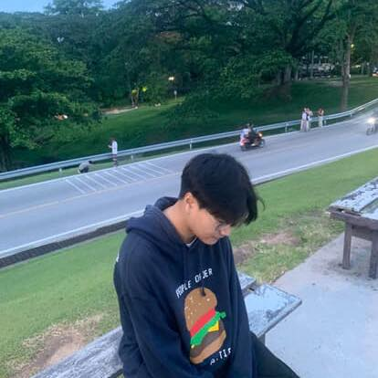

  

# Hi 👋, I'm Thanapat Siriprapasuk

### 💻 Inter Back-end Developer  
*"Turning ideas into delightful, scalable software."*

---

## 🌍 Location
📍 Based in **Chiang Mai, Thailand**

---

## ⚡ Tech Stack & Tools

---

## 🚀 About Me
- 🌱 Currently learning **Mobile apps & Web Development**  
- 🛠 Daily driver stack: **Java · Flutter · C++ · JavaScript · Spring Boot / MVC**  
- 🎯 2025 Goal: **Ship an OSS library / High-impact project**  
- 📫 Reach me at: **safe.pmk32@gmail.com**  

---

## 🌐 Socials

---

## 🤝 Let’s Connect
> *“Great products are built by great people working together.”*  

- 💌 Email: **safe.pmk32@gmail.com**  
- 🐦 DM me on [X/Twitter](#)  
- 🔗 LinkedIn: [Profile](#)

---

  

